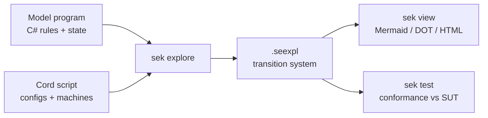

# SpecExplorerKit (SEK)

**Model-based testing, revived.**

SpecExplorerKit (SEK) is a modern, CLI-first, cross-platform reimagining of
Microsoft **Spec Explorer**. You write a small *model program* that captures the
intended behavior of a system, describe the scenarios you care about in the
**Cord** language, and SEK explores the model into a finite-state **transition
system** that you can view, generate tests from, and replay against a real
implementation to check *conformance*.

SEK targets **.NET 8**, runs anywhere .NET runs, needs **no Visual Studio**, and
uses the **Z3 theorem prover** to power parameter generation.

- 📖 **Documentation:** [`docs/`](docs/) (browse locally with DocFX — see below)
- 🧩 **Spec Kit extension:** [`extensions/spec-kit-sek/`](extensions/spec-kit-sek/)
- 🧪 **Samples:** [`samples/`](samples/) — the classic Spec Explorer 2010 suite, ported

## The SEK loop



## Quick start

```bash
# Build the toolkit
dotnet build src/Sek.Cli/Sek.Cli.csproj

# Explore a sample and view it
sek explore AccountExploration --project samples/Account
sek view samples/Account/.specexplorerkit/out/AccountExploration.seexpl --format html --out account.html
```

Install `sek` as a global tool from a release:

```bash
dotnet tool install -g sek --add-source <feed-or-nupkg-folder>
```

## Repository layout

| Path | Contents |
|---|---|
| `src/` | The engine: `Sek.Core`, `Sek.Modeling`, `Sek.Solver` (Z3), `Sek.Cord`, `Sek.Engine`, `Sek.Cli`. |
| `docs/` | DocFX documentation site (MS-Learn-style). |
| `samples/` | The nine ported Spec Explorer 2010 samples. |
| `extensions/spec-kit-sek/` | The Spec Kit community extension. |
| `skills/` | VS Code agent skills (e.g. viewing `.seexpl`). |
| `scripts/` | Packaging / release helpers. |

## Building the docs

```bash
dotnet tool install -g docfx
cd docs
docfx docfx.json --serve
# open http://localhost:8080
```

## Architecture

SEK is split into focused, general-purpose libraries — **no sample-specific code
lives in the engine**:

- **Sek.Core** — the transition-system IR (`.seexpl`) and Mermaid/DOT/HTML renderers.
- **Sek.Modeling** — the modeling runtime (`ModelProgram`, `[Rule]`, `[Domain]`, `[AcceptingCondition]`, `Require`, `Condition`).
- **Sek.Solver** — the parameter solver seam with a Z3 backend and a dependency-free enumerative fallback.
- **Sek.Cord** — the Cord lexer, parser, AST, and constraint extraction.
- **Sek.Engine** — the deterministic BFS explorer (state hashing, guards, parameter generation, reachable-object domains) and the Cord behavior automaton.
- **Sek.Cli** — the `sek` command-line tool (`init`, `validate`, `explore`, `view`, `test`).

## License

[MIT](LICENSE).

## Acknowledgements

SEK revives the ideas of Microsoft Spec Explorer and its **Cord** language, and is
distributed as a [Spec Kit](https://github.github.io/spec-kit/) community extension.
