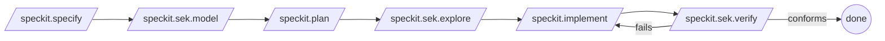

# Using SEK as a Spec Kit extension

SEK ships as a **Spec Kit community extension** (`spec-kit-sek`). It adds
model-based testing to the spec-driven development (SDD) lifecycle: turn a feature's
acceptance criteria into an executable **model**, **explore** it for edge cases, and
**verify** that your implementation conforms.

- **Category:** `code` &nbsp;•&nbsp; **Effect:** `read-write`
- **Commands:** `/speckit.sek.model`, `/speckit.sek.explore`, `/speckit.sek.verify`

## Prerequisites

- [Spec Kit](https://github.github.io/spec-kit/) (`specify`) installed.
- .NET SDK 8.0+.
- The `sek` tool: `dotnet tool install -g SpecExplorerKit.Tool`.

## Install the extension

```bash
specify extension add spec-kit-sek \
  --from https://github.com/stuartpa/sek/releases/latest/download/spec-kit-sek.zip
```

For local development against a checkout of this repo:

```bash
specify extension add --dev ./extensions/spec-kit-sek
```

## The commands

### `/speckit.sek.model`

Reads the active feature's `spec.md` (especially the acceptance criteria) and
generates a SEK **model program** plus a **Cord** scenario, then scaffolds the
project and runs `sek validate`. Category effect: creates model/Cord/config files.

### `/speckit.sek.explore`

Builds the model and runs `sek explore`, then summarizes the transition system
(states, transitions, accepting states, coverage) and renders a diagram you can drop
into `plan.md` or a pull request.

### `/speckit.sek.verify`

Runs `sek test` to replay the exploration against your implementation via a binding,
and reports conformance (`TEST PASSED` / `TEST FAILED`). Use it as a gate before
marking a feature's tasks complete.

## Where it fits in the SDD lifecycle



1. **Specify** the feature as usual.
2. **Model** it (`/speckit.sek.model`) — the acceptance criteria become an
   explorable model.
3. **Plan** and **explore** (`/speckit.sek.explore`) — review reachable behavior and
   edge cases before writing code.
4. **Implement**, then **verify** (`/speckit.sek.verify`) — gate on conformance.

## Configuration

The commands operate on a `.specexplorerkit/config.json` in the feature folder — see
[Project configuration](../reference/project-config.md).

## Publishing / catalog

The extension's catalog metadata is prepared in
`extensions/catalog.community.json`. Per Spec Kit's
[Extension Publishing Guide](https://github.com/github/spec-kit/blob/main/extensions/EXTENSION-PUBLISHING-GUIDE.md),
submit it via the **Extension Submission** issue template (do not PR the catalog
directly). The release provides the `spec-kit-sek.zip` asset that the catalog's
`download_url` points at.

## Related

- [Install SEK](../install/index.md)
- [Running conformance](../guides/conformance.md)
- Extension source: [`extensions/spec-kit-sek/`](https://github.com/stuartpa/sek/tree/main/extensions/spec-kit-sek)
