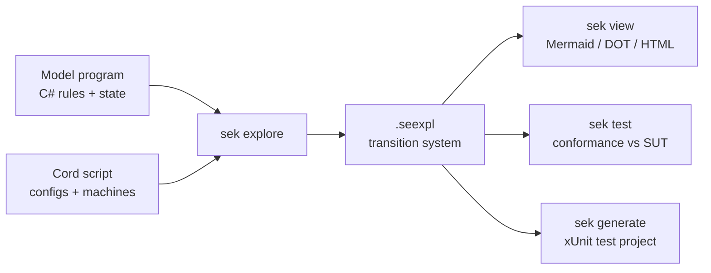

# SpecExplorerKit (SEK)

**Model-based testing, revived.**

SpecExplorerKit (SEK) is a modern, CLI-first, cross-platform reimagining of
Microsoft [Spec Explorer](concepts/history-and-lineage.md). You write a small
*model program* that captures the intended behavior of a system, describe the
scenarios you care about in the **Cord** language, and SEK explores the model
into a finite-state **transition system** that you can view, generate tests
from, and replay against a real implementation to check *conformance*.

SEK targets **.NET 8**, runs anywhere the .NET runtime runs, needs **no Visual
Studio**, and uses the **Z3 theorem prover** to power parameter generation.

> [!TIP]
> New here? Jump to the [Quickstart](guides/quickstart.md) and explore your
> first model in five minutes, or read [What is model-based testing?](concepts/what-is-mbt.md).

## Why SEK

| | |
|---|---|
| **CLI-first** | One tool, `sek`. Scriptable, CI-friendly, editor-agnostic. Works great in VS Code with no proprietary extension required. |
| **Cross-platform .NET 8** | No Windows-only runtime, no Visual Studio, no legacy `Microsoft.Modeling`. |
| **Z3-powered** | Parameter domains and combination strategies are solved by the [Z3 theorem prover](concepts/parameter-generation.md). |
| **Cord preserved** | The [Cord](reference/cord-language.md) scenario/configuration language is a first-class citizen. |
| **Reviewable artifacts** | Explorations are emitted as `.seexpl` JSON and rendered to Mermaid, DOT, or HTML. |
| **Conformance built in** | Replay an exploration against your system under test and get a pass/fail report. |

## The SEK loop

1. **Author a model.** Derive from `ModelProgram`, hold state in public
   properties, and write `[Rule]` methods guarded with `Require(...)`.
2. **Describe scenarios in Cord.** Configurations declare actions, parameter
   domains, and bounds; machines compose behavior with the Cord operator algebra.
3. **Explore.** `sek explore` performs a deterministic breadth-first search,
   using Z3 to generate parameter combinations, and writes a `.seexpl`
   transition system.
4. **View.** `sek view` renders the graph as Mermaid, Graphviz DOT, or a
   self-contained HTML page.
5. **Verify.** `sek test` replays every explored transition against a binding
   to your real implementation and reports conformance.
6. **Generate tests.** `sek generate` emits a runnable xUnit test project whose
   tests replay covering scenarios against your implementation.

## Proven on the classic samples

SEK is validated against the original Spec Explorer 2010 sample suite, ported to
the modern toolchain. See [Samples](samples/index.md):

- **Operators** — the full Cord behavior algebra.
- **ParameterGeneration** — Z3 combination strategies (interaction, pairwise, predicates).
- **Account**, **PubSub** — dynamic object domains.
- **atsvc**, **chat**, **SMB2** — protocol state machines.
- **Sailboat** — a stateful model with parameterized navigation.
- **TPC-C** — a large model with full conformance replay (2,446 states / 12,706 transitions).

## Part of the Spec Kit ecosystem

SEK ships as a [Spec Kit community extension](community/spec-kit-extension.md),
bringing model-based testing into the spec-driven development lifecycle: turn
acceptance criteria into an executable model, explore it for edge cases, and
verify your implementation conforms.

## Next steps

- [Install SEK](install/index.md)
- [Quickstart](guides/quickstart.md)
- [Migrating from Spec Explorer](guides/migrating-from-spec-explorer.md)
- [Concepts](concepts/index.md)
- [CLI reference](reference/cli.md)
- [Cord language reference](reference/cord-language.md)
